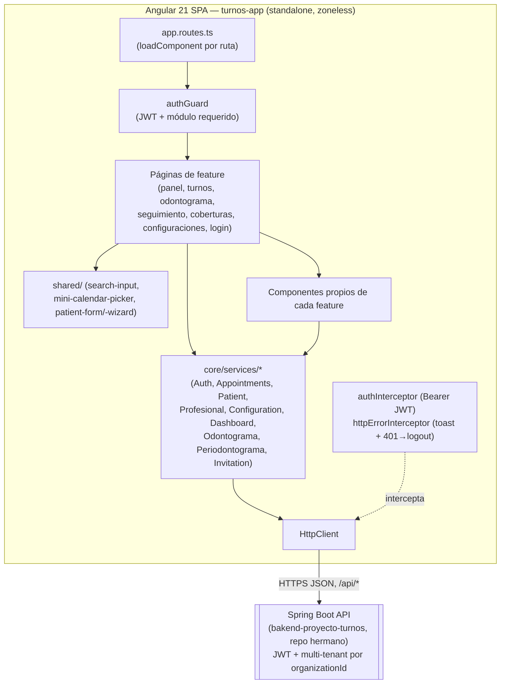

# Arquitectura — OdontoLite (turnos-app)

> Punto de entrada sugerido para cualquier IA/desarrollador nuevo. El resto de `docs/` asume que ya leíste esto.

## Stack real (verificado en `package.json` y en el código)

- **Framework**: Angular **21** (`@angular/core ^21.0.0`), con **componentes standalone** (no hay `NgModule` de features, solo `bootstrapApplication` en `src/main.ts`).
- **Change detection**: `provideZonelessChangeDetection()` (Angular zoneless, sin Zone.js) — ver `src/app/app.config.ts`. Esto implica que las plantillas deben evitar crear objetos/arrays nuevos en cada evaluación (hay comentarios explícitos sobre esto en `PatientDataService`, ver [STATE.md](./STATE.md)).
- **Routing**: `@angular/router`, rutas standalone con `loadComponent` (lazy por componente), ver [ROUTES.md](./ROUTES.md).
- **Formularios**: mezcla de Reactive Forms (`@angular/forms` `FormBuilder`/`FormGroup`) y formularios template-driven (`ngModel`), ver [FORMS.md](./FORMS.md).
- **HTTP**: `HttpClient` con interceptores funcionales (`withInterceptors`), no hay librería HTTP de terceros.
- **Estado**: servicios singleton (`providedIn: 'root'`) con `BehaviorSubject` de RxJS (patrón predominante) + `signal()`/`computed()` de Angular en el código más nuevo (coberturas, odontograma). No hay NgRx, Akita ni ningún store de terceros. Ver [STATE.md](./STATE.md).
- **UI/CSS**: Bootstrap 5 + Bootstrap Icons + SCSS propio (variables/mixins). No hay Angular Material, Tailwind ni CSS-in-JS. Ver [DESIGN_SYSTEM.md](./DESIGN_SYSTEM.md).
- **Gráficos**: Chart.js vía `ng2-charts` (solo en el Panel/dashboard).
- **Testing**: `ng test` corre con **Vitest** (`tsconfig.spec.json` referencia `vitest/globals`), pero **no existe ningún archivo `*.spec.ts` en `src/`** — no hay tests unitarios escritos hoy. Ver nota sobre `POMS/` en la sección "Testing e2e" más abajo.
- **Sin backend propio**: no hay `express`, `cors`, `mysql2` ni ningún paquete de servidor en `package.json`. Este repo es un **frontend puro (SPA)**; no corre ningún proceso server-side propio. Ver [DEPENDENCIES.md](./DEPENDENCIES.md).

## Cómo se resuelve la URL del backend

No hay archivos `environment.ts`/`environment.prod.ts` de Angular. La URL base de la API se decide en tiempo de ejecución, en el navegador, comparando el hostname:

```ts
// src/app/core/services/api.config.ts
const isProduction = window.location.hostname !== 'localhost';
export const API_CONFIG = {
  baseUrl: isProduction
    ? 'https://backend-turnos-jg3n.onrender.com/api'
    : 'http://localhost:8080/api',
  endpoints: { patients: '/patients', profesionales: '/profesionales', appointments: '/appointments',
    auth: '/auth', configuration: '/configuration', coberturas: '/coberturas',
    intermediarios: '/intermediarios', invitations: '/invitations' }
};
```

Todos los servicios HTTP (`core/services/*.ts` y los `*.service.ts` de `features/coberturas/`) construyen su URL a partir de `API_CONFIG.baseUrl + API_CONFIG.endpoints.<recurso>`.

## Estructura de carpetas

```
src/
├── main.ts                      # bootstrapApplication(App, appConfig)
├── index.html                   # shell HTML, <base href="/">, fuente Poppins
├── styles.scss, _variables.scss, _mixins.scss   # design system global (ver DESIGN_SYSTEM.md)
└── app/
    ├── app.ts / app.html / app.scss / app.config.ts / app.routes.ts   # raíz de la app y configuración
    ├── core/                    # capa de infraestructura transversal (sin UI)
    │   ├── guards/              # authGuard (funcional, CanActivateFn)
    │   ├── interceptors/        # authInterceptor, httpErrorInterceptor, http-context (SKIP_GLOBAL_ERROR_HANDLER)
    │   ├── models/               # interfaces TS que espejan los DTOs del backend (barrel en models/index.ts)
    │   ├── services/             # servicios singleton HTTP + estado en caché (Auth, Appointments, Patient, Profesional, Configuration, Dashboard, Odontograma, Periodontograma, Invitation, ErrorHandler, Notification)
    │   └── utils/                # funciones puras (fechas, moneda, nombre completo, asignabilidad de profesionales)
    ├── layout/
    │   └── navbar/               # app-navbar: pestañas visibles según módulos habilitados del usuario
    ├── shared/                   # componentes/validators reutilizables entre 2+ features
    │   ├── components/           # search-input, mini-calendar-picker, patient-form, patient-wizard
    │   ├── constants/             # paises-latam.ts (catálogo LatAm, debe coincidir con el backend)
    │   └── validators/            # custom-validators.ts (documento, teléfono, nombre de persona)
    └── features/                  # un directorio por módulo de negocio; cada uno agrupa sus propias pages/components/services
        ├── auth/login/
        ├── panel/panel-view/                    # dashboard
        ├── appointments/{pages/turnos-view, components/*}
        ├── calendar/components/month-calendar/  # calendario mensual reutilizado por turnos
        ├── odontograma/{components/*, services/*, models/}
        ├── seguimiento/{seguimiento-view, components/*, utils/}
        ├── coberturas/{coberturas-view, coberturas.service.ts, intermediarios.service.ts, coberturas.models.ts}
        └── configuraciones/{configuraciones-view, components/invitation-dialog, components/profesional-dialog}
```

`public/` contiene assets estáticos servidos tal cual (logo, imágenes de landing, iconos del odontograma, favicon) — mapeado por `angular.json` (`assets: [{ glob: '**/*', input: 'public' }]`).

## Capas y responsabilidades

| Capa | Carpeta | Responsabilidad |
|---|---|---|
| Infraestructura | `core/` | HTTP, auth, modelos, utilidades puras — sin conocimiento de UI |
| Layout | `layout/` | Cáscara visual persistente (navbar) |
| Compartido | `shared/` | Componentes/validators usados por ≥2 features |
| Features | `features/<nombre>/` | Un módulo de negocio: página(s) enrutada(s) + sus componentes/servicios propios |
| Raíz | `app.*` | Bootstrap, rutas, providers globales |

Dentro de cada `features/<x>/` el patrón habitual es `pages/` o `<x>-view/` (contenedor enrutado) + `components/` (hijos de presentación con `@Input`/`@Output`) + a veces un `*.service.ts` local (p. ej. `coberturas.service.ts`, `patient-data.service.ts`) cuando el estado es específico de esa vista y no necesita ser singleton global.

## Patrones de diseño detectados

- **Standalone components + `loadComponent` por ruta**: cada página es code-split automáticamente por el bundler de Angular (`@angular/build:application`), no hay `NgModule`s de feature.
- **Guards/interceptors funcionales**: `authGuard: CanActivateFn`, `authInterceptor`/`httpErrorInterceptor: HttpInterceptorFn` — API moderna de Angular (sin clases `Injectable` para esto).
- **Servicio-caché singleton**: `AppointmentsService`, `PatientService`, `ProfesionalService`, `ConfigurationService` guardan un `BehaviorSubject` como caché en memoria, se recargan automáticamente al loguearse (`auth.currentUser$`) y se vacían al hacer logout (`auth.loggedOut$`). Los componentes casi nunca llaman `findAll()` directo: se suscriben al observable cacheado.
- **Facade**: `OdontogramaStateService` no tiene estado propio de piezas dentales; delega en `OdontoStateService` (odontograma) y `PerioStateService` (periodontograma) y solo coordina la carga combinada (`forkJoin`) y el guardado combinado (`saveTurnoCompleto`, un solo PATCH que persiste ambos).
- **Delta de cambios (no CRUD pleno)**: el odontograma/periodontograma no reenvían el estado completo al guardar. Cada `*StateService` mantiene un "baseline" (snapshot cargado del backend) y calcula un **delta** (`build*Delta()`) comparando el estado actual contra el baseline, para que el backend aplique solo los cambios del turno actual (`cambiosTurno`) sin pisar el histórico (`estadoActual`). Ver `core/utils` en [odonto-delta.util.ts / perio-delta.util.ts](../src/app/features/odontograma/services/).
- **Componente de diálogo controlado por `[open]`/`(openChange)`**: patrón repetido en `ConfirmDialogComponent`, `AppointmentDialogComponent`, `InvitationDialogComponent`, `ProfesionalDialogComponent`, `SaveOdontogramaDialogComponent` — el padre es dueño del booleano `open` y el hijo lo notifica al cerrarse (similar a two-way binding manual). Ver [COMPONENTS.md](./COMPONENTS.md).
- **Configuración de formulario compartida como función pura**: `getPatientFormConfig(fb)` (en `shared/components/patient-form/patient-form.config.ts`) define los controles/validators del formulario de paciente una sola vez; lo reutilizan `AppointmentDialogComponent`, `PatientWizardPanelComponent` (seguimiento) y `PatientFormComponent`/`PatientWizardComponent` (shell del wizard de 5 pasos).
- **Migración parcial a Signals**: los módulos más nuevos (`coberturas-view`, `odontograma-view`, `save-odontograma-dialog`) usan `signal()`/`computed()` en vez de `BehaviorSubject`; el resto de la app (turnos, seguimiento, panel) sigue usando RxJS `BehaviorSubject` + `async`/suscripción manual. Conviven ambos estilos.
- **HTTP error handling en dos capas**: el interceptor global (`httpErrorInterceptor`) decide si un error se notifica solo (toast) o si además se re-lanza para que el componente lo maneje; los componentes pueden optar por manejar el error ellos mismos pasando `skipGlobalErrorHandler()` como `HttpContext` (evita doble notificación). Detalle en [UI_RULES.md](./UI_RULES.md).

## Diagrama de arquitectura



## Cómo llama al backend

1. `AuthService.login()`/`register()` obtienen un JWT (`AuthResponse.token`) y lo guardan en `localStorage` (`auth_token`, `auth_user`) junto con `organizationId`, `role` y `modules` (lista de módulos habilitados para ese usuario).
2. `authInterceptor` agrega `Authorization: Bearer <token>` a toda request salvo las de `/auth/*`.
3. El backend resuelve el tenant (organización) a partir del JWT — el frontend nunca envía `organizationId` explícito en las URLs, salvo donde el modelo lo expone de vuelta (p. ej. `Configuration.organizationId`).
4. `httpErrorInterceptor` intercepta toda respuesta de error: si es 401 fuera de `/auth/`, hace `logout()` + redirige a `/login`; si no, decide entre notificar globalmente (toast) o dejar que el componente lo resuelva.

## Testing e2e (`POMS/`)

La carpeta raíz `POMS/` contiene Page Object Models de Playwright (`login.page.ts`, `turnos.page.ts`, `odontograma.page.ts`, `seguimiento.page.ts`) que usan `@playwright/test`. **Ese paquete no está declarado en `package.json` de este repo** — los Page Objects existen acá pero el runner de tests vive en el repo hermano `frontend-proyecto-tests`. Los `data-testid` que ves repetidos en casi todos los templates HTML de este repo existen para ser consumidos por esos Page Objects.

## Pendiente de completar por el desarrollador

- No hay documentación en el código sobre el catálogo completo de roles (`AuthResponse.role`). Solo se verificó en código el uso de `'OWNER'` (`AuthService.hasRole('OWNER')`, usado en `ProfesionalesPanelComponent` para mostrar "Invitar usuario" y habilitar la creación de accesos). No se pudo determinar desde el frontend qué otros valores de `role` existen ni sus permisos — es información del backend.
- No existen archivos `*.spec.ts`: no se puede documentar cobertura de tests unitarios porque no hay ninguno.
- No hay `README`/config que explique la relación exacta entre este repo y `frontend-proyecto-tests` (dónde corre Playwright, cómo se referencian los Page Objects de `POMS/` desde el otro repo).
