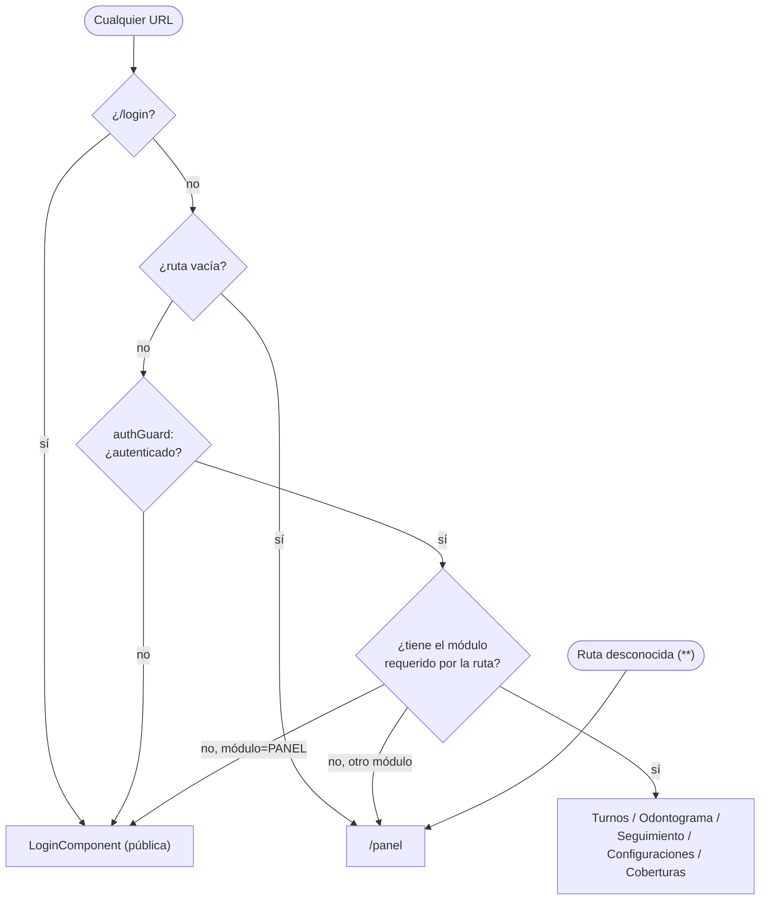

# Rutas — OdontoLite (turnos-app)

Fuente única: [`src/app/app.routes.ts`](../src/app/app.routes.ts). Todas las rutas son standalone (`loadComponent`, sin `NgModule`s de feature) y viven en un único array `Routes`, sin rutas hijas anidadas.

## Árbol de rutas

| Ruta | Pública/Protegida | Guard | `data.module` requerido | Componente cargado | Redirecciones |
|---|---|---|---|---|---|
| `/login` | Pública | — | — | `LoginComponent` | — |
| `` (raíz) | — | — | — | — | `redirectTo: 'panel'` (`pathMatch: 'full'`) |
| `/panel` | Protegida | `authGuard` | `PANEL` | `PanelViewComponent` | — |
| `/turnos` | Protegida | `authGuard` | `TURNOS` | `TurnosViewComponent` | — |
| `/odontograma/:appointmentId` | Protegida | `authGuard` | `ODONTOGRAMA` | `OdontogramaViewComponent` | — |
| `/odontograma` (sin id) | — | — | — | — | `redirectTo: 'turnos'` (`pathMatch: 'full'`) |
| `/seguimiento` | Protegida | `authGuard` | `SEGUIMIENTO` | `SeguimientoViewComponent` | — |
| `/configuraciones` | Protegida | `authGuard` | `CONFIGURACIONES` | `ConfiguracionesViewComponent` | — |
| `/coberturas` | Protegida | `authGuard` | `COBERTURA` | `CoberturasViewComponent` | — |
| `**` (wildcard) | — | — | — | — | `redirectTo: 'panel'` |

## Guard: `authGuard`

Archivo: [`src/app/core/guards/auth.guard.ts`](../src/app/core/guards/auth.guard.ts). `CanActivateFn` funcional (no clase), se ejecuta en cada ruta protegida:

```ts
export const authGuard: CanActivateFn = (route) => {
  const authService = inject(AuthService);
  const router = inject(Router);

  if (!authService.isAuthenticated()) {
    router.navigate(['/login']);
    return false;
  }

  const requiredModule = route.data?.['module'] as string | undefined;
  if (requiredModule && !authService.hasModule(requiredModule)) {
    router.navigate([requiredModule === 'PANEL' ? '/login' : '/panel']);
    return false;
  }

  return true;
};
```

Lógica:
1. **Autenticación**: `AuthService.isAuthenticated()` decodifica el JWT guardado en `localStorage` (`auth_token`) y valida su `exp` (expiración) sin llamar al backend. Si no hay token o expiró, hace `logout()` (limpia `localStorage`) y redirige a `/login`.
2. **Autorización por módulo**: cada ruta protegida declara `data: { module: 'XXX' }`. `AuthService.hasModule(code)` chequea que `code` esté en `AuthResponse.modules` (array de códigos de módulo habilitados para ese usuario, entregado por el backend en el login). Si el usuario no tiene el módulo:
   - Si el módulo requerido era `PANEL` → redirige a `/login` (caso borde: usuario sin ningún módulo habilitado).
   - Cualquier otro módulo → redirige a `/panel`.

No hay un guard de "solo lectura" ni de rol (`OWNER`/etc.) a nivel de ruta — el control de rol (p. ej. `AuthService.hasRole('OWNER')`) se hace **dentro** de los componentes (ver [PAGES.md](./PAGES.md) y la nota de memoria del proyecto sobre autorización diferida), no en el `Routes` array.

## Códigos de módulo (`data.module`) y su relación con el navbar

Los mismos códigos de módulo controlan qué pestañas del navbar se muestran (`layout/navbar/navbar.component.ts`, `MODULE_OPTIONS` en `core/models/profesional.model.ts`):

| Código | Ruta asociada | Label en navbar |
|---|---|---|
| `PANEL` | `/panel` | Panel |
| `TURNOS` | `/turnos` | Turnos |
| `ODONTOGRAMA` | `/odontograma/:appointmentId` (no navega directo; requiere turno activo) | Odontograma |
| `SEGUIMIENTO` | `/seguimiento` | Seguimiento |
| `COBERTURA` | `/coberturas` | Cobertura |
| `CONFIGURACIONES` | `/configuraciones` | Configuración |

El acceso a `/odontograma/:appointmentId` desde el navbar es especial: el link no navega directo a una ruta fija (`requiresAppointment: true` en `NavItem`); `NavbarComponent.onNavClick()` intercepta el click, busca el último `appointmentId` activo en `OdontogramaStateService.appointmentIdValue` (que persiste en `sessionStorage`, clave `odontograma_last_appointment_id`) y navega a `/odontograma/<id>` si existe, o muestra un toast informativo y navega a `/turnos` si no hay turno cargado.

## Diagrama



## Pendiente de completar por el desarrollador

- No hay guard de salida (`CanDeactivate`) documentado en el código para advertir sobre formularios sin guardar al navegar fuera (p. ej. el wizard de paciente o el odontograma con cambios pendientes).
- No se determinó si existe algún mecanismo de "página no autorizada" distinta de redirigir silenciosamente a `/panel` — no hay ruta `/403` ni `/unauthorized`.
