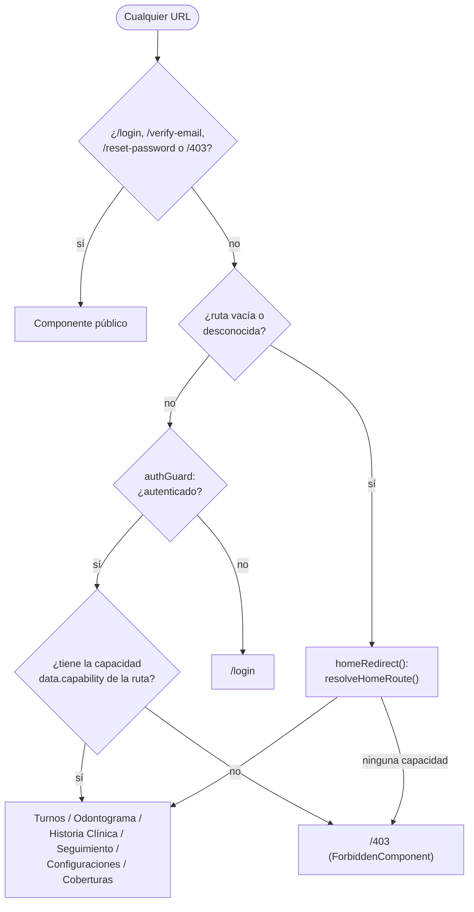

# Rutas — OdontoLite (turnos-app)

Fuente única: [`src/app/app.routes.ts`](../src/app/app.routes.ts). Todas las rutas son standalone (`loadComponent`, sin `NgModule`s de feature) y viven en un único array `Routes`, sin rutas hijas anidadas.

## Árbol de rutas

| Ruta | Pública/Protegida | Guard | `data.capability` requerida | Componente cargado | Redirecciones |
|---|---|---|---|---|---|
| `/login` | Pública | — | — | `LoginComponent` | — |
| `/verify-email` | Pública | — | — | `VerifyEmailComponent` | — |
| `/reset-password` | Pública | — | — | `ResetPasswordComponent` | — |
| `/403` | Pública | — | — | `ForbiddenComponent` | — |
| `` (raíz) | — | — | — | — | `redirectTo: homeRedirect` (`pathMatch: 'full'`, función, no string fijo) |
| `/panel` | Protegida | `authGuard` | `PANEL:VIEW` | `PanelViewComponent` | — |
| `/turnos` | Protegida | `authGuard` | `TURNOS:VIEW` | `TurnosViewComponent` | — |
| `/odontograma/:appointmentId` | Protegida | `authGuard` | `ODONTOGRAMA:VIEW` | `OdontogramaViewComponent` | — |
| `/odontograma` (sin id) | — | — | — | — | `redirectTo: 'turnos'` (`pathMatch: 'full'`) |
| `/historia-clinica/:appointmentId` | Protegida | `authGuard` | `HISTORIA_CLINICA_FREE:VIEW` | `HistoriaClinicaViewComponent` | — |
| `/historia-clinica` (sin id) | — | — | — | — | `redirectTo: 'turnos'` (`pathMatch: 'full'`) |
| `/seguimiento` | Protegida | `authGuard` | `SEGUIMIENTO:VIEW` | `SeguimientoViewComponent` | — |
| `/configuraciones` | Protegida | `authGuard` | `CONFIGURACIONES:VIEW` | `ConfiguracionesViewComponent` | — |
| `/coberturas` | Protegida | `authGuard` | `COBERTURA:VIEW` | `CoberturasViewComponent` | — |
| `**` (wildcard) | — | — | — | — | `redirectTo: homeRedirect` |

`/odontograma/:appointmentId` y `/historia-clinica/:appointmentId` son dos instancias del mismo patrón: una ruta por **módulo clínico**, cada una detrás de la capacidad `<CODIGO_MODULO>:VIEW` de ese módulo. Ver la nota sobre módulos clínicos múltiples en [ARCHITECTURE.md](./ARCHITECTURE.md).

### Visibilidad del navbar en rutas públicas — bug real, corregido (2026-08-07)

`App.showNavbar` (componente raíz, [`app.ts`](../src/app/app.ts)) decide si se monta `<app-navbar>`. Hasta esta fecha arrancaba en `true` por default y solo se corregía en el primer evento `NavigationEnd` del router — en un deep-link directo a una ruta pública (el caso real: un usuario **sin sesión** abre desde su mail el link de `/reset-password` o `/verify-email`), el navbar llegaba a montarse igual en ese primer render. Al montarse disparaba su propio fetch (`GET /api/modules/rules`) sin token, recibía 401, y `http-error.interceptor.ts` — que manda **cualquier** 401 fuera de `/auth/*` derecho a `/login`, incondicionalmente — cerraba la sesión (inexistente) y redirigía antes de que la página pública llegara a mostrarse. Además, la lista de rutas consideradas "públicas" para el navbar solo incluía `/login`, nunca `/reset-password` ni `/verify-email`.

**Impacto real, no solo de tests:** ningún usuario podía completar un reset de contraseña o verificación de email por link de mail — el navbar los expulsaba a `/login` antes de que la página cargara. Encontrado escribiendo AUTH-067 en `frontend-proyecto-tests`.

**Fix:** el valor inicial de `showNavbar` se deriva de `window.location.pathname` real al arrancar (no un default fijo), y la lista de rutas públicas se amplió a las tres (`/login`, `/reset-password`, `/verify-email`). De paso se agregaron los `data-testid` que le faltaban a `reset-password.component.html` (no tenía ninguno, lo que había ocultado el bug — no había forma de verificar por E2E que la página se mostrara).

## Guard: `authGuard`

Archivo: [`src/app/core/guards/auth.guard.ts`](../src/app/core/guards/auth.guard.ts). `CanActivateFn` funcional (no clase), se ejecuta en cada ruta protegida:

```ts
export const authGuard: CanActivateFn = (route) => {
  const authService = inject(AuthService);
  const router = inject(Router);

  if (!authService.isAuthenticated()) {
    router.navigate(['/login']);
    return false;
  }

  const requiredCapability = route.data?.['capability'] as string | undefined;
  if (requiredCapability && !authService.hasCapability(requiredCapability)) {
    router.navigate(['/403']);
    return false;
  }

  return true;
};

/** Destino de `/` y de cualquier ruta desconocida: la primera pestaña que el usuario puede ver. */
export const homeRedirect = (): string => {
  const authService = inject(AuthService);
  if (!authService.isAuthenticated()) {
    return '/login';
  }
  return resolveHomeRoute(c => authService.hasCapability(c));
};
```

Lógica:
1. **Autenticación**: `AuthService.isAuthenticated()` decodifica el JWT guardado en `localStorage` (`auth_token`) y valida su `exp` (expiración) sin llamar al backend. Si no hay token o expiró, hace `logout()` (limpia `localStorage`) y redirige a `/login`.
2. **Autorización por capacidad**: cada ruta protegida declara `data: { capability: Capability.XXX_YYY }` (constante de [`core/auth/capabilities.ts`](../src/app/core/auth/capabilities.ts), no un string suelto). `AuthService.hasCapability(code)` chequea que `code` esté en el set resuelto a partir de `AuthResponse.capabilities` (ver [ARCHITECTURE.md](./ARCHITECTURE.md) y [PERMISOS.md](./PERMISOS.md)). Si el usuario no tiene la capacidad requerida, redirige a **`/403`** — antes de este cambio redirigía a `/panel` (el módulo `data.module` reemplazado dejaba al usuario en una pantalla sin explicación); ahora `ForbiddenComponent` es una página propia.

Reemplaza también al viejo `hasModule`: `data.module`/`AuthService.hasModule()` ya no existen en el código, todo el árbol de rutas quedó migrado a `data.capability`/`hasCapability()`.

No hay un guard de "solo lectura" ni de rol (`OWNER`/etc.) a nivel de ruta — el control de rol (p. ej. `AuthService.hasRole('OWNER')`) se hace **dentro** de los componentes (ver [PAGES.md](./PAGES.md) y la nota de memoria del proyecto sobre autorización diferida), no en el `Routes` array.

## `homeRedirect` y `resolveHomeRoute`

La raíz (`''`) y el wildcard (`**`) ya no apuntan a un string fijo (`redirectTo: 'panel'`): apuntan a la función `homeRedirect` ([`core/guards/auth.guard.ts`](../src/app/core/guards/auth.guard.ts)), que delega en `resolveHomeRoute()` ([`core/auth/home-route.ts`](../src/app/core/auth/home-route.ts)). `resolveHomeRoute` recorre una lista fija de pestañas (`/panel`, `/turnos`, `/seguimiento`, `/coberturas`, `/configuraciones`, en ese orden) y devuelve la primera cuya capacidad (`PANEL_VIEW`, `TURNOS_VIEW`, etc.) tiene el usuario; si no tiene ninguna, devuelve `/403`. `/odontograma`/`/historia-clinica` no figuran en esa lista: no tienen una ruta fija, siempre se entra desde un turno concreto (ver más abajo). Antes de este cambio, un usuario sin `PANEL` que entraba a `/` terminaba en `/login`, indistinguible de una sesión vencida — ver `docs/PERMISOS.md § 6.5` (referenciado desde el propio código).

## Capacidades de vista (`data.capability`) y su relación con el navbar

Las mismas capacidades `<MODULO>:VIEW` controlan qué pestañas del navbar se muestran (`layout/navbar/navbar.component.ts`, `MODULE_OPTIONS` en `core/models/profesional.model.ts`):

| Capacidad | Ruta asociada | Label en navbar |
|---|---|---|
| `PANEL:VIEW` | `/panel` | Panel |
| `TURNOS:VIEW` | `/turnos` | Turnos |
| `ODONTOGRAMA:VIEW` / `HISTORIA_CLINICA_FREE:VIEW` / (futuros módulos clínicos) | `/odontograma/:appointmentId` / `/historia-clinica/:appointmentId` (no navegan directo; requieren turno activo) | Atención (una sola pestaña para todos los módulos clínicos) |
| `SEGUIMIENTO:VIEW` | `/seguimiento` | Seguimiento |
| `COBERTURA:VIEW` | `/coberturas` | Cobertura |
| `CONFIGURACIONES:VIEW` | `/configuraciones` | Configuración |

El acceso a los módulos clínicos desde el navbar es especial: la pestaña "Atención" no navega directo a una ruta fija (`requiresAppointment: true` en `NavItem`, ver `NavbarComponent`); `NavbarComponent.onNavClick()` intercepta el click, busca el último turno atendido en `ClinicalAttentionService.getLast()` (que persiste en `sessionStorage`, clave `ultima_atencion`, con el `appointmentId` **y** la `rutaClinica` del módulo — ver [STATE.md](./STATE.md)) y navega a `/<rutaClinica>/<id>` si existe, o muestra un toast informativo y navega a `/turnos` si no hay turno cargado. La pestaña se muestra si el usuario tiene `VIEW` de **cualquier** módulo clínico (`NavbarComponent.hasAnyClinicalCapability()`), resuelto dinámicamente contra `GET /api/modules/rules` (`ModuleRulesService`), no contra una lista hardcodeada de módulos.

## Diagrama


```mermaid
flowchart TD
  Start(["Cualquier URL"]) --> IsLogin{"¿/login, /verify-email,<br/>/reset-password o /403?"}
  IsLogin -- sí --> Public["Componente público"]
  IsLogin -- no --> Root{"¿ruta vacía o<br/>desconocida?"}
  Root -- sí --> Home["homeRedirect():<br/>resolveHomeRoute()"]
  Root -- no --> Guard{"authGuard:<br/>¿autenticado?"}
  Guard -- no --> Login["/login"]
  Guard -- sí --> Cap{"¿tiene la capacidad<br/>data.capability de la ruta?"}
  Cap -- no --> Forbidden["/403 (ForbiddenComponent)"]
  Cap -- sí --> Dest["Turnos / Odontograma /<br/>Historia Clínica / Seguimiento /<br/>Configuraciones / Coberturas"]
  Home --> Dest
  Home -- ninguna capacidad --> Forbidden
```

## Pendiente de completar por el desarrollador

- No hay guard de salida (`CanDeactivate`) documentado en el código para advertir sobre formularios sin guardar al navegar fuera (p. ej. el wizard de paciente, el odontograma o la historia clínica con cambios pendientes).
